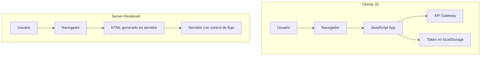

# JavaScript en el Navegador: Una Fuente Persistente de Riesgos de Seguridad

## Introducción

El uso de JavaScript en el cliente web es una práctica dominante en el desarrollo moderno, impulsada por frameworks como React, Angular o Vue. Sin embargo, desde una perspectiva de seguridad Zero Trust (ZT), ejecutar código en el navegador plantea riesgos estructurales que no pueden ser mitigados completamente mediante herramientas o buenas prácticas.

Este documento presenta una taxonomía detallada de los problemas de seguridad derivados del uso de JavaScript en el navegador, comparándolos con enfoques alternativos más seguros, y propone una transición hacia arquitecturas server-rendered centradas en la confianza mínima.

---

## 1. Entorno de Ejecución No Confiable

### Problemas

* El código JavaScript se ejecuta en el navegador del usuario, un entorno fuera del control del servidor.
* El código es completamente visible y modificable.
* No existen enclaves seguros para ejecución aislada (como un TEE).

### Consecuencias

* Inspección de lógica sensible.
* Manipulación de funciones y flujo de control.
* Reproducción de peticiones y abuso de API.

---

## 2. Vulnerabilidades de Inyección y Manipulación del DOM

### Ejemplos comunes

* **XSS (Cross-Site Scripting)**.
* **Prototype Pollution**.
* **DOM Clobbering / Injection**.
* **CSP Bypass**.

### Causa raíz

La naturaleza dinámica de JavaScript y su integración con el DOM lo hacen susceptible a inyecciones.

---

## 3. Gestión Insegura de Credenciales

### Riesgos comunes

* Almacenamiento en `localStorage`, `sessionStorage`, cookies.
* Exposición en DevTools, logs de red, o scripts de terceros.
* Tokens largos sin expiración ni revocación activa.

### Resultado

* Robo de sesión.
* Persistencia del acceso post-compromiso.
* Incapacidad para garantizar control contextual de acceso.

---

## 4. Inseguridad en la Cadena de Suministro

### Riesgos

* Dependencias NPM comprometidas (ej: `event-stream`).
* Carga dinámica de scripts desde CDNs.
* Build tooling automático sin verificación de integridad.

### Impacto

* Inyección de código malicioso en producción.
* Pérdida de control de versiones y comportamientos.

---

## 5. Falta de Garantías Criptográficas en Cliente

* JS no puede manejar claves privadas de forma segura.
* No existen medios de firma o verificación sin riesgo de exposición.
* TLS en transporte no compensa la falta de integridad de la lógica en cliente.

---

## 6. Dependencia del Navegador y del Usuario

* La seguridad depende de la configuración del navegador, extensiones y versión.
* El usuario puede desactivar mecanismos críticos como JavaScript o CSP.
* El entorno no es homogéneo ni auditado.

---

## 7. Falsa Sensación de Seguridad

| Creencia común                     | Realidad                                                                    |
| ---------------------------------- | --------------------------------------------------------------------------- |
| "Usamos TypeScript"                | El código se transpila a JavaScript, sin protección en tiempo de ejecución. |
| "Minificamos el código"            | Sigue siendo visible y reversible con DevTools.                             |
| "Nuestros tokens están protegidos" | Son accesibles desde cualquier script del mismo origen.                     |

---

## Comparativa: JavaScript vs HTML Server-Rendered

| Criterio                  | JavaScript SPA | HTML Server-Rendered |
| ------------------------- | -------------- | -------------------- |
| Superficie de ataque      | Alta           | Mínima               |
| Visibilidad del código    | Total          | Nula                 |
| Gestión de tokens         | En cliente     | En servidor          |
| Cumplimiento ZT           | Parcial o nulo | Alto                 |
| Dependencia del navegador | Alta           | Baja                 |
| Soporte sin JS            | No             | Sí                   |

---

## Diagrama: Modelo de Confianza en Cliente JS vs Server-Rendered

---

## Conclusión

JavaScript en el navegador introduce una serie de riesgos que son incompatibles con los principios de una arquitectura Zero Trust coherente. Aunque las mitigaciones parciales son posibles, **la única forma robusta de eliminar estos riesgos es reestructurar la arquitectura para no depender de código ejecutado en el cliente**.

El camino hacia una seguridad real implica revisar dogmas asumidos y volver a modelos donde el servidor mantiene el control completo del flujo, la lógica y el estado.

---

## Referencias

1. OWASP Top 10 (2023): [https://owasp.org/www-project-top-ten/](https://owasp.org/www-project-top-ten/)
2. Supply Chain Attacks in JavaScript Ecosystem – Snyk: [https://snyk.io/blog/javascript-supply-chain-security/](https://snyk.io/blog/javascript-supply-chain-security/)
3. CSP Bypass Techniques – PortSwigger: [https://portswigger.net/web-security/csp/bypassing](https://portswigger.net/web-security/csp/bypassing)
4. Browser security model limitations – Google: [https://developer.chrome.com/docs/privacy-sandbox/overview/](https://developer.chrome.com/docs/privacy-sandbox/overview/)
5. "Why I don't trust the frontend" – Dan Abramov: [https://overreacted.io/why-i-dont-trust-the-front-end/](https://overreacted.io/why-i-dont-trust-the-front-end/)

---
